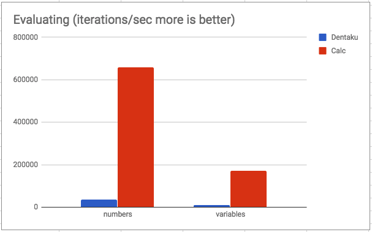

# Kalculator

A rubygem to safely and quickly evaluate mathematical and logical expressions entered by a user.
This library is very similar to [dentaku](https://github.com/rubysolo/dentaku) in purpose, but it emphasizes simplicity and performance.

## Changes in 1.0.0
**Summary of changes:**

-  removed support for NestedLookup
-  removed the simple type checking inside of the evaluator
-  added a validation step for type checking
  - added the idea of types into the language
    - added a generic container type
  - added a TypeSources that mirrors DataSources
- added Pointers to DataSources and TypeSources
- added an accessing operator to the language "." that allows accessing data in nested structures
  - added a MappedObject Type for validating the type of objects
  - added a second access operator " object["attribute"]"
  - allowed contains() function to operate on objects
- Lists (in order to be validated) must hold values of only one type

## Basic Usage

```ruby
Kalculator.evaluate("5 + 8 - 3") # => 10
Kalculator.evaluate("A * C", {"A" => 1, "C" => 8}) # => 8
```

If you have an expression that you want to execute multiple times (ie run the same calculation on a bunch of different datasets), you can create a `Kalculator` instance which will memoize the parsed AST.

```ruby
kalculator = Kalculator.new("13 * Price - Taxes")
kalculator.evaluate({"Price" => 8.5, "Taxes" => 1.35}) # => 109.15
```
## Type Checking
  Type checking is done entirely through a validation step very similarly to evaluation.

  Validation will either throw an error or return the type of the expression given to it.

  ** List of *basic* Kalculator Types**
  (Indentation shows isa relationship)

  - Object
    - Kalculator::Comparable
      - Kalculator::Number
      - Kalculator::Percent
    - Kalculator::Bool
    - Kalculator::Time

To run a simple type check on an expression all you have to do is validate using `Kalculator`

  ```ruby
  Kalculator.validate("5 + 8 - 3") # => Kalculator::Number
  ```

To send type data to a function you just send a `TypeSources` object to validate

  ```ruby
  types = Kalculator::TypeSources.new({"A"=> Kalculator::Number, "B" => Kalculator::String})
  Kalculator.validate("A * B", types) # => raises Kalculator::Error
  ```
That `TypeSources` object can take any number of Hashes of variable names to types

  ```ruby
  types = Kalculator::TypeSources.new({"A"=> Kalculator::Number},{"B" => Kalculator::String})
  ```

### Container Types

  Since containers hold objects of otherTypes, they need to be instantiated in different ways for Validation

  The different container types are:

  - Object
    - Kalculator::Container
      - Kalculator::List
      - Kalculator::String
      - Kalculator::MappedObject # more on this later

To use these Container types you have to instantiate them with `.new`

Each container type has special `==` , `>=` , and `<=` methods for comparison, along with a `genericType?(type)` method to see if a certain type is the same type as the generic type for this container

Containers can be added to a `TypeSources` object in this manner

  ``` ruby
  types = Kalculator::TypeSources.new({"a"=>Kalculator::List.new(type), "b"=>Kalculator::String.new})
  ```
  where `type` is the generic type of the `List`

As you can see, Strings don't need a type passed to them because they always contain Strings

## Objects

Objects in `Kalculator` are represented as nested variables in the `DataSources`
``` ruby
objectdata = Kalculator::DataSources.new({"person"=>{"name"=>"bob", "age" => 56, "mother"=>{"name"=> "suzy", "age"=> 86}}})
```
Object types in `Kalculator` are represented as a `MappedObject` object

``` ruby
objecttype = Kalculator::DataSources.new({"person"=>Kalculator::MappedObject.new({"name"=>Kalculator::String.new, "age" => Kalculator::Number, "mother"=>Kalculator::MappedObject.new({"name"=> Kalculator::String.new, "age"=> Kalculator::Number})})})
```

Object data can be accessed using the `.` operator or the `[""]` operator

``` ruby
Kalculator.evaluate("person.mother.name", objectdata) #=> "suzy"
Kalculator.validate("person.mother.name", objecttype) #=> Kalculator::String.new
```
``` ruby
Kalculator.evaluate("person.mother[\"name\"]", objectdata) #=> "suzy"
Kalculator.validate("person.mother[\"name\"]", objecttype) #=> Kalculator::String.new
```

## Pointers
Pointers allow for you to reference another variable inside of a data source  by constructing a new `Kalculator::Pointer` with the name of the variable to point to

``` ruby
objectdata = Kalculator::DataSources.new({"person"=>{"name"=>"bob", "age" => 56, "mother"=>{"child"=>Kalculator::Pointer.new("person")}}})
```
Same with a type source

``` ruby
objecttype = Kalculator::DataSources.new({"person"=>Kalculator::MappedObject.new({"name"=>Kalculator::String.new, "age" => Kalculator::Number, "mother"=>Kalculator::MappedObject.new({"child"=>Kalculator::Pointer.new("person")})})})
```
and they evaluate and validate the same
``` ruby
Kalculator.evaluate("person.mother.child.name", objectdata) #=> "suzy"
Kalculator.validate("person.mother.child.name", objecttype) #=> Kalculator::String.new
```

## Syntax Summary
 If statement : if(condition, true_clause, false_clause)

 exists expression : exists(var_name)

 accessor operator : object.element    or    object["element"]

 Null : null

 Binary Operations (>,>=,==,+, etc.) : expression + expression

 Bang : !expression

 List : [expression, expression, expression, expression] (or whatever size you like)

 Built In function call : func(expression, expression) (or however many arguments the function supports)


## Built in Functions

Kalculator provides a group of built in functions for more complex calculations

| Function | Arg Types | Description |

| contains  | `[Collection.new(Object), Object]`  | returns true if an object is present in a certain collection |

| count   | `[List.new(Object)]`  | returns the number of elements in a list |

| date  | `[String.new]`  | returns a Date object of the parsed string |

| max | `[Number,Number]` | returns the max of two numbers |

| min | `[Number,Number]` | returns the min of two numbers |

| sum | `[List.new(Number)]`  | returns the sum of the numbers in a list |

## Performance

This project emphasizes performance and includes a few benchmarks.
You can run these like this:

```
bundle exec ruby benchmarks/parsing.rb
```

The last time I compared these benchmarks against the performance of `dentaku` I found that the performance was ~17.5x faster when evaluating expressions and about the same when parsing them.



## Contributing

Bug reports and pull requests are welcome on GitHub at https://github.com/mmmries/kalculator. This project is intended to be a safe, welcoming space for collaboration, and contributors are expected to adhere to the [Contributor Covenant](http://contributor-covenant.org) code of conduct.

## License

The gem is available as open source under the terms of the [MIT License](https://opensource.org/licenses/MIT).

## Code of Conduct

Everyone interacting in the Kalculator project’s codebases, issue trackers, chat rooms and mailing lists is expected to follow the [code of conduct](https://github.com/mmmries/kalculator/blob/master/CODE_OF_CONDUCT.md).
